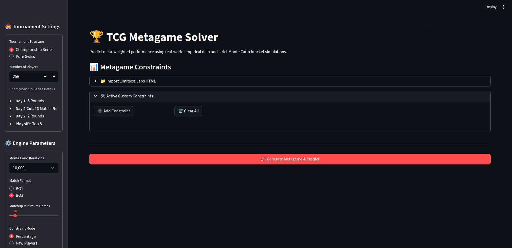
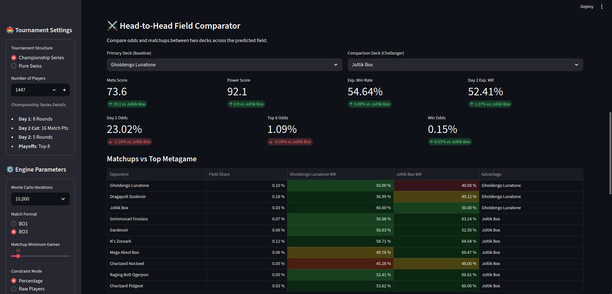
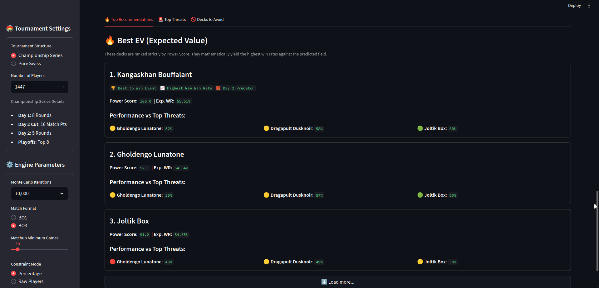
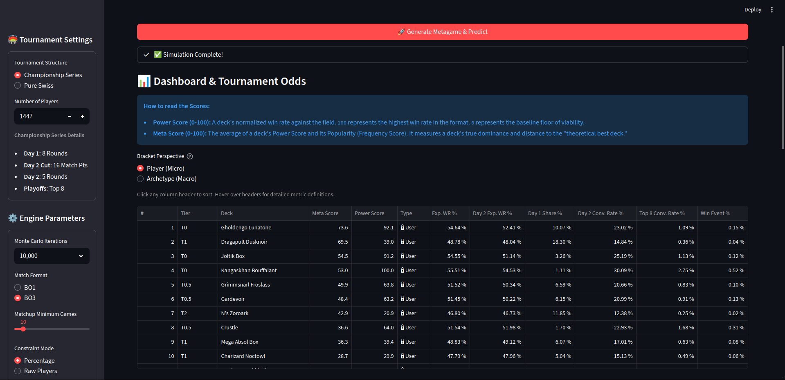

# Pokémon TCG Metagame Simulator

This project is a high-fidelity analytical suite designed to model both the immediate, stochastic reality of competitive **Pokémon Trading Card Game (TCG)** tournaments and the long-term evolutionary trends of its metagame.

The simulator bridges rigorous tournament mathematics with evolutionary game theory to provide a complete picture of the TCG metagame:
- **Monte Carlo Bracket Engine🏆** Evaluates short-term tournament success by simulating up to 1,000,000 iterations. It natively supports official Play! Pokémon Variant #5 structures, seeded Top Cut pairings, and a Parabolic Tie Convergence model that mathematically mirrors real-world BO3 match-point decay.
- **Replicator Dynamics Engine🧬** Predicts the Evolutionary Stable State (ESS) by iterating through thousands of generations. It identifies the "unexploitable" equilibrium point where deck frequencies stabilize, revealing which archetypes truly define a format over time.

The former is integrated with a Streamlit dashboard, vectorized Swiss metrics, and dynamic Z-score evaluations, it provides deep strategic insights from two perspectives: macro-level archetype dominance and individual Expected Value (EV) for surviving the "Day 2 bubble"

| Main Dashboard & Controls | Head-to-Head Comparator  |
| :---: | :---: |
|  |  |
| **Top Recommendations** | **Simulation Diagnostics** |
|  |  |

---

## 🚀 Features

### 🎲 Stochastic Tournament Modelling (Monte Carlo)
*   **High-Fidelity Bracket Engine** which simulates up to 1,000,000 full tournament iterations (Swiss + Single-Elimination Playoffs) using parallelised NumPy workers.
*   **Parabolic Tie Convergence** which is able to model the ~15% real-world "match-point bleed" using a parabolic probability curve to ensure close matchups correctly result in ties (1 point).
*   **Heuristic Rematch Prevention** helps actively preventing players from hitting the same opponent twice during Swiss rounds.
*   **X-3 Drop Logic** to simulate real-world tournament attrition by dropping players from the bracket once they accumulate three losses.

### 📊 Advanced Competitive Analytics
*   **Meta & Power Scoring.** Normalised 0–100 rankings evaluate decks based on win rates against the field (Power Score) and their overall format dominance (Meta Score). The mathematical framework for these metrics is directly inspired by the **[Vicious Syndicate Data Reaper](https://www.vicioussyndicate.com/drr/faq-data-reaper-report/)** methodology.
*   **Vectorised Metagame Constraints.** A high-speed, pure NumPy water-filling algorithm strictly enforces user-defined exact, minimum, or maximum field share constraints.
*   **Dynamic Clustering & RPS.** Uses K-Means with Silhouette Optimisation and `StandardScaler` to accurately group archetypes based on their strategic matchup shape. Network graphing helps identify non-transitive Rock-Paper-Scissors cycles.

### 💻 Containerized Microservice Architecture
* **RESTful API.** A FastAPI entry point validates requests via Pydantic schemas and delegates heavy mathematical computation safely.
* **Headless Worker.** A Huey background task runner isolates execution of computationally heavy Monte Carlo arrays and ESS replications, writing back to a lightweight SQLite broker.
* **Professional Streamlit Interface.** An interactive, tool-tipped dashboard with instant perspective toggles to seamlessly swap data between Individual EV and Macro Impact without recalculating.

### 🧬 Metagame Evolution (Replicator Dynamics)
*   **Evolutionary Stability.** Models the "Game Theory" of a metagame using Replicator Dynamics. Successful decks grow in frequency proportional to their meta-weighted performance.
*   **Deck Extinction & Reintroduction.** Simulates innovation and meta-shifts. Poorly performing decks can die out, while "rogue" decks can be randomly reintroduced to challenge the established equilibrium.

---

## 📦 Installation

### Option 1: Docker Compose (Recommended)

The application is orchestrated as a three-tier microservice using Docker Compose.

1. **Clone the repository:**
```bash
git clone https://github.com/leonid-dalin/pokemon-tcg-metagame-simulator.git
cd pokemon-tcg-metagame-simulator
```
2. **Build and launch the services:**
```bash
docker-compose up --build -d
```

This spins up three containers: `api` (FastAPI on port 8000), `worker` (Huey task runner), and `ui` (Streamlit on port 8501).

### Option 2: Local Python Environment

0. **Get [Python 3.12](https://www.python.org/downloads/)**

    **Windows:**
    ```PowerShell
    winget install -e --id Python.Python.3.12
    ```

1.  **Clone the repository:**
    ```bash
    git clone https://github.com/leonid-dalin/pokemon-tcg-metagame-simulator.git
    cd pokemon-tcg-metagame-simulator
    ```

2.  **Set up a virtual environment:**
    ```bash
    python3.12 -m venv venv
    source venv/bin/activate  # On Windows: venv\Scripts\activate
    ```

3.  **Install dependencies:**
    ```bash
    pip install -r requirements.txt
    ```

---

## 🛠️ Usage

### Running the Web Dashboard
If running via Docker, navigate to `http://localhost:8501` in your browser to access the Streamlit UI.

If running locally:
1. Start the API: ```uvicorn src.api.main:app --host 0.0.0.0 --port 8000```
2. Start the worker: ```huey_consumer src.worker.queue.huey -w 4 -k thread```
3. Start the UI: ```streamlit run src/ui/app.py```

### CLI Executions

The simulator also supports robust headless operations through the Command Line Interface.

## 🧬 Engine 1: Long-Term Metagame Evolution (ESS)

Predict the Evolutionary Stable State over thousands of generations using Replicator Dynamics.

```bash
python -m src.ui.cli -i data/input/ea_input.json -g 10_000 --mode replicator
```

## 🏆 Engine 2: Immediate Tournament Solver (Monte Carlo)

Run a quick tournament simulation directly from the terminal to fetch Expected Value (EV).

```bash
python -m src.ui.cli -i data/input/ea_input.json --predict --players 512
```

## Key Command-Line Arguments

| Short Flag | Long Flag               | Description                                                                 | Default             | Type    |
| ---------- | ----------------------- | --------------------------------------------------------------------------- | ------------------- | ------- |
| `-i`       | `--input`               | Path to the matchup data JSON file (e.g., `input/ea_input.json`).           | `input/ea_input.json` | `str`   |
| `-o`       | `--output`              | Directory to save simulation results, plots, and logs. Created if missing.   | `output/`            | `str`   |
| `-M`       | `--mode`                | Simulation dynamics engine: `replicator` (ESS) or `tournament` (Agent).     | `replicator`        | `str`   |
| `-g`       | `--gens`                | Maximum number of generations/epochs to simulate.                           | `1000`              | `int`   |
| `-m`       | `--min-games`           | Minimum required match volume to include an archetype in the baseline.      | `100`               | `int`   |
| `-e`       | `--extinction-threshold`| Metagame frequency drop-off point where a deck is considered mathematically dead. | `1e-10`             | `float` |
| `-N`       | `--noise`               | Scale of Gaussian noise injected into generation payoffs.                   | `0.0`               | `float` |
| `-I`       | `--intro-prob`          | Stochastic probability per generation of a rogue/extinct deck re-entering.  | `0.0`               | `float` |
| `-s`       | `--seed`                | Fixed RNG seed for perfectly reproducible experiments.                      | `1312`              | `int`   |
|            | `--tournament-style`    | Bracket execution logic: `pure_swiss` (fast) or `championship_series` (BO3).| `pure_swiss`        | `str`   |
|            | `--no-plot`             | Suppress generation of interactive HTML Plotly graphs (headless runs).      | `False`             | `bool`  |
| `-C`       | `--cluster`             | Enable Silhouette-optimized K-Means strategic archetype clustering.         | `False`             | `bool`  |
| `-l`       | `--log-level`           | Terminal logging verbosity: `DEBUG`, `INFO`, `WARNING`, or `ERROR`.         | `INFO`              | `str`   |
| `-b`       | `--batch`               | Enable batch execution mode for automated parameter sweeping.               | `False`             | `bool`  |
| `-c`       | `--batch-config`        | Path to the JSON configuration file defining batch parameters.              | `None`              | `str`   |
|            | `--predict`             | Bypass evolution entirely and run the static Monte Carlo EV solver.         | `False`             | `bool`  |
| `-P`       | `--players`             | Expected total field size for the upcoming event (Prediction Mode).         | `32`                | `int`   |
|            | `--meta`                | Comma-separated custom field constraints (e.g., "DeckA:0.2").               | `""`                | `str`   |

> **🚫 Validation:** Invalid values (e.g., `--intro-prob 1.5` or negative `--noise`) will cause immediate, descriptive `argparse` errors.
     

---

## 📂 Output

After running the simulation, a uniquely named directory (e.g., `YYYYMMDD_HHmmss_replicator_gens1000K_CONV@2017410`) will be created within your specified output directory. This directory will contain the following files:

*   `ess_equilibrium.csv`: The final state of the metagame, listing each deck's frequency, activity status, and extinction history.
*   `final_tiers.json`: A tier list (T0, T0.5, T1, T2, T3, T4) generated based on the **final state** of the metagame.
*   `simulation.txt`: A detailed log file of the simulation run, including convergence metrics, tier list summaries, and clustering results.
*   `metagame_evolution.html`: An interactive Plotly graph showing the frequency of each deck over time.
*   `matchup_heatmap.html`: An interactive heatmap of the win rate matrix.
*   `matchup_network.html`: An interactive network graph visualizing deck matchups and identified RPS cycles.
*   `deck_similarity.json`: Pairwise strategic similarity matrix using Pearson Correlation.
	
---

## 🤝 Contributing

Contributions are welcome! :D Please open an issue to discuss a feature or bug, and submit a pull request for any changes.

---

## 🙏 Acknowledgements

This project stands on the shoulders of giants and would not be possible without the foundational work and data provided by several key members of the competitive metagaming community.

*   **Limitless TCG**: An enormous shoutout to the team at [Limitless](https://limitlesstcg.com/). This entire project is powered by the comprehensive and meticulously maintained Pokémon TCG data scraped from their website. Their platform is an indispensable resource for the global Pokémon TCG community. If you use their tools (and you should!), please consider supporting them on [Patreon](https://patreon.com/limitlesstcg) to ensure they can continue their fantastic work.

*   **Vicious Syndicate**: I personally owe a profound debt to [Vicious Syndicate](https://www.vicioussyndicate.com/) for pioneering rigorous, community-driven data analytics in the digital card game space. Their *Data Reaper Reports* and podcast set the global gold standard for metagame analysis, serving as an indispensable foundation for my own education in competitive modeling. This project’s Power & Meta Scoring metrics are directly inspired by their standardized 0–100 normalization methodology. Beyond the math, their commitment to transparency and data integrity has been a guiding light for this project’s philosophy and my own development as a human being. :) 

*   **Dominic Calkosz & HearthNash**: A massive thank you to **Dominic** for his groundbreaking research on game-theoretic metagame analysis in Hearthstone. His project, [HearthNash](https://dominic-calkosz.com/HearthNash), was a direct inspiration for applying evolutionary dynamics and Nash equilibrium concepts to TCG metagames. His academic approach provided the theoretical bedrock for this simulator.

*   **FPL Analytics Community:** My journey was also profoundly shaped by the Discord community of the **FPL Analytics Community**. Engaging in their discussions, learning from their approach to data, and even experimenting around with meta-solvers such as **[Solio](https://fpl.solioanalytics.com/)** and **[FPL Review](https://fplreview.com/)** provided the foundational inspiration for this project. The concepts of "solving" a dynamic, stochastic game and the importance of probabilistic forecasting were directly translated into the **Monte Carlo tournament engine** and **EV prediction logic** used here. Their insights into data-driven decision-making were invaluable to my development as a developer and analyst.

This project is a synthesis of their collective efforts, and I am deeply grateful for the ecosystems they have created, and the bricks they've placed. 🙇 So, **_thank you_** for existing. 

---

## 📜 License

<a href="https://github.com/leonid-dalin/pokemon-tcg-metagame-simulator/">Pokémon TCG Metagame Evolution Simulator</a> © 2025 by <a href="https://github.com/leonid-dalin/">Leonid Dalin</a> is licensed under <a href="https://creativecommons.org/licenses/by-nc-sa/4.0/">CC BY-NC-SA 4.0</a><br>


The use of any content in this repository for training any artificial intelligence (AI) model, or for any form of AI to remix, adapt, or build upon my works, especially without my explicit permission, is strictly prohibited.