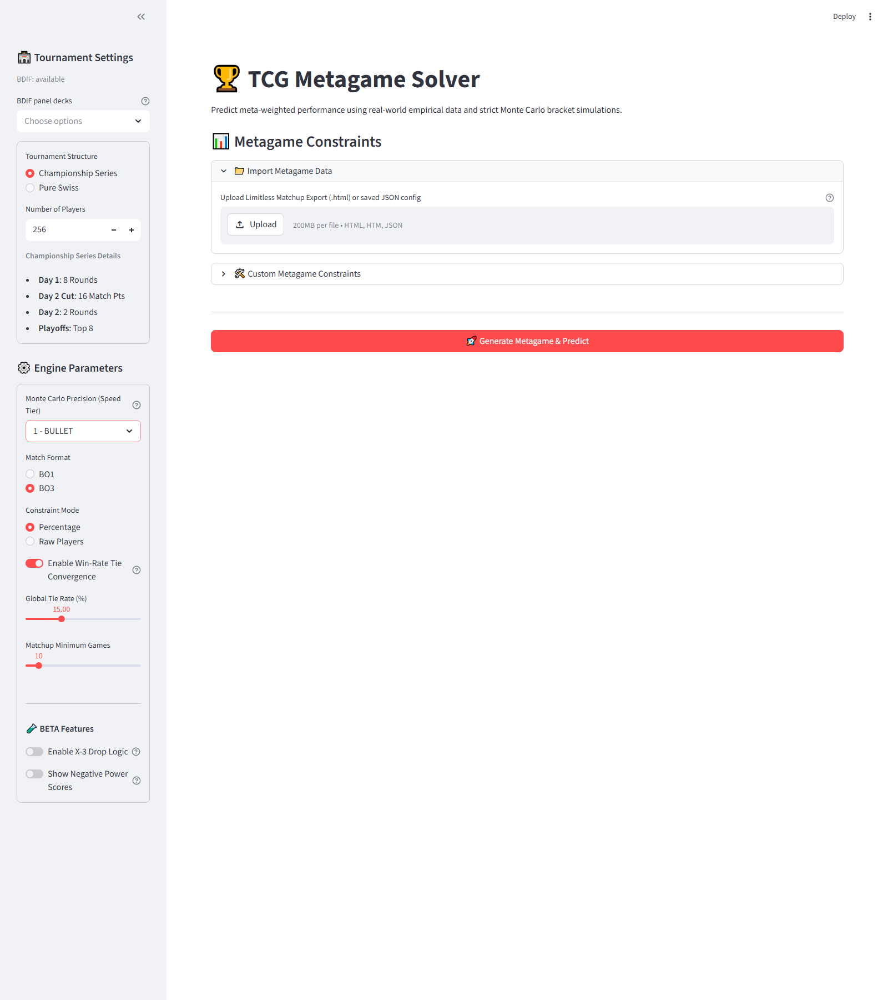
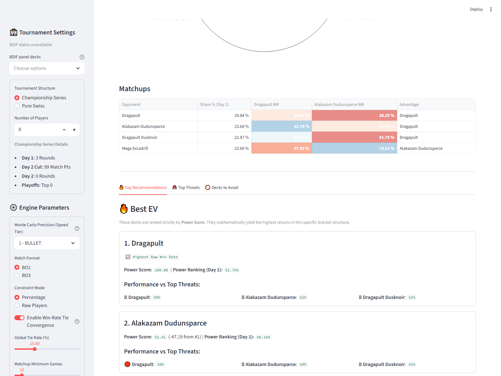
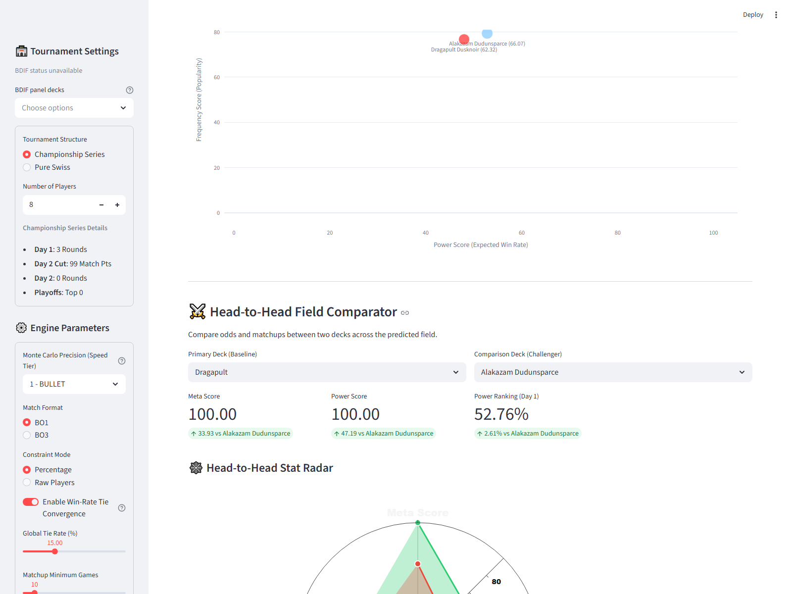
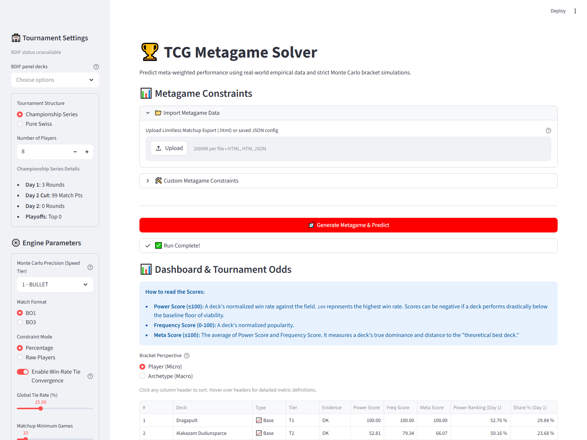

# Pokemon TCG Metagame Simulator

<p align="center">
  <a href="https://github.com/leonid-dalin/pokemon-tcg-metagame-simulator/actions/workflows/tests.yml"></a>
  
  <a href="LICENSE"></a>
</p>

A Python and Rust toolkit for Pokemon TCG metagame analysis. It has a replicator model for long-run field changes and a Monte Carlo tournament model for event outcomes. Docker Compose runs the Streamlit dashboard, FastAPI, Huey worker, Redis, and Jaeger

## App showcase

| Current dashboard before a run | Completed Best EV recommendations |
|:---:|:---:|
|  |  |
| Completed head-to-head comparator | Completed tournament results |
|  |  |

Best-60 card recommendations are available in the results tabs when `BDIF_USE_CARD_MODEL` is enabled and the configured Limitless snapshot contains usable decklists. The completed result captures use the checked-in four-archetype fixture with 8 players, BO1, and `1 - BULLET`. The screenshots above show the standard tournament dashboard and do not claim a populated Best-60 report

## Quick start

Requirements: Docker Desktop with Compose support

```bash
git clone https://github.com/leonid-dalin/pokemon-tcg-metagame-simulator.git
cd pokemon-tcg-metagame-simulator
git lfs pull
docker compose up -d --build
```

Open the dashboard at `http://localhost:8501` or the API reference at `http://localhost:8000/docs/`. The local Limitless snapshot is stored with Git LFS

Stop the services with:

```bash
docker compose down
```

## Run the CLI

Set up Python and the Rust extension with the [local development guide](docs/how-to/local-development.md), then run commands from the repository root

Run replicator dynamics:

```bash
python -m src.ui.cli --input data/input/ea_input.json --mode replicator --gens 10000
```

Run the static tournament predictor with the checked-in matchup example:

```bash
python -m src.ui.cli --input examples/predict_input.json --predict --players 512 --no-plot
```

The CLI writes timestamped result folders below `output/`. The [CLI guide](docs/how-to/run-cli.md) covers tournament and batch runs

## Runnable examples

- `examples/library_prediction.py` calls the Python data loader and tournament solver
- `examples/api_prediction.py` submits a request to FastAPI and reads the task event stream
- `examples/snapshot_summary.py` checks the snapshot manifest hash and reports read-only database counts

Run Python examples from the repository root. The API example uses `API_URL` if set, otherwise `http://127.0.0.1:8000/api/v1`

## Documentation

| You need to | Read |
| --- | --- |
| Start the dashboard or run a prediction | [Quickstart tutorial](docs/tutorial/quickstart.md) |
| Use CLI modes and batch input | [CLI how-to](docs/how-to/run-cli.md) |
| Run Docker Compose | [Compose how-to](docs/how-to/run-compose.md) |
| Use the HTTP API | [API reference](docs/reference/api.md) |
| Enable Limitless ingestion and BDIF reports | [BDIF how-to](docs/how-to/enable-bdif.md) |
| Understand the 60-card data and Best-60 rules | [Limitless ingestion reference](docs/limitless-ingestion.md) |
| Find other guides and references | [Documentation index](docs/README.md) |
| See historical changes | [Changelog](docs/CHANGELOGS.md) |

For contribution guidance, community standards, security reports, licence terms, and data notices, see [CONTRIBUTING.md](CONTRIBUTING.md), [CODE_OF_CONDUCT.md](CODE_OF_CONDUCT.md), [SECURITY.md](SECURITY.md), [LICENSE](LICENSE), and [THIRD_PARTY_NOTICES.md](THIRD_PARTY_NOTICES.md)

## Data and tests

The default simulation input is `data/input/ea_input.json`. It contains archetype names and a matchup matrix. Limitless tournament ingestion and card-model reports are disabled by default; see [Enable Limitless and BDIF analytics](docs/how-to/enable-bdif.md)

Run the tests in the project environment:

```bash
python -m pytest -q
```

The Docker build compiles `src/tournament/tcg_engine` with Maturin before installing the wheel

## Licence

Copyright (C) 2025 Leonid Dalin. This project is licensed under [GNU AGPL-3.0-or-later](LICENSE)

The use of repository content for training any artificial intelligence (AI) model without explicit consent is prohibited
